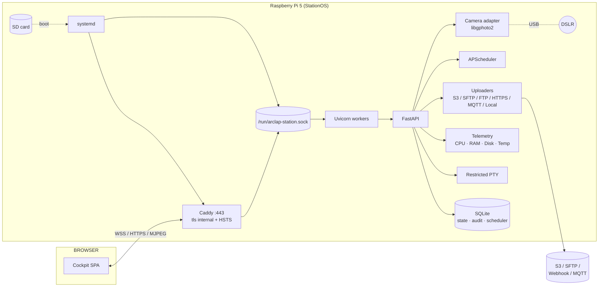

# Arclap Station

[](LICENSE)
[](https://github.com/arclap-af/arclap-station/actions/workflows/test.yml)
[](https://github.com/arclap-af/arclap-station/actions/workflows/release.yml)

Arclap Station is the on-device cockpit for a Raspberry Pi 5 tethered to a DSLR. Plug a Pi into a Canon, Nikon, Sony, Fuji (or any libgphoto2-supported body), flash an SD card, and open `https://arclap-st-<serial>.local/` from a laptop on the same LAN. The first-boot wizard walks you through Wi-Fi, time zone, login, camera, schedule, destinations and an acceptance test — then signs off with a tamper-evident report.

It's Python/FastAPI + Vite/React + TypeScript, designed to be flashed once and forgotten until the next firmware bump.

---

## 1. What it is

A self-contained device controller you flash onto an SD card and put on a shelf. It exposes:

- A **setup wizard** (Wi-Fi, time, login, camera, schedule, destinations, acceptance).
- A **real-time MJPEG viewfinder** with shutter / aperture / ISO / WB controls.
- **APScheduler** for time-lapse, single-shot bursts, and event-driven captures.
- A **multi-destination uploader** with retries (S3 / SFTP / FTP / HTTPS webhook / local / MQTT).
- A **restricted PTY terminal** in the browser for supported diagnostics.
- A **signed acceptance report** that an installer or auditor can verify offline.

Everything is in two repos: backend (`backend/arclap_station`) and frontend (`frontend/`). This README documents the deployment layer that turns those into a one-curl install on a fresh Pi.

---

## 2. Quick install

SSH into a freshly flashed Pi 5 running Raspberry Pi OS Bookworm 64-bit and run:

```bash
curl -fsSL https://raw.githubusercontent.com/arclap-af/arclap-station/main/install.sh | sudo bash
```

Pin a specific release:

```bash
curl -fsSL https://raw.githubusercontent.com/arclap-af/arclap-station/main/install.sh \
  | sudo ARCLAP_VERSION=v0.1.0 bash
```

After the install finishes (~3 minutes on first boot), the script prints:

```
┌────────────────────────────────────────────────────────────┐
│  Arclap Station is installed and running.                  │
└────────────────────────────────────────────────────────────┘

  Open on the same LAN:   https://arclap-st-1a2b3c4d.local/
  IPv4 fallback:          https://192.168.1.42/
```

Open the URL on a laptop on the same LAN. Trust the self-signed certificate. Walk the wizard. Done.

---

## 3. What you get

### Filesystem layout after install

```
/opt/arclap-station/
├── venv/                       Python 3.11 virtualenv with the wheel
├── releases/                   side-by-side staging for atomic updates
└── wheels/                     downloaded artifacts kept for diagnostics

/var/www/arclap/                Static frontend bundle (served by Caddy)
/etc/arclap/                    auth.json · station.json · destinations/*
/var/lib/arclap/                state.db · scheduler.db · audit.db · thumbnails/
/media/sdcard/photos/           Captures (the only path Caddy never serves)
/var/log/arclap/                Rotated log copies (journald is canonical)
/run/arclap-station.sock        UNIX socket Caddy talks to
```

### Architecture (Mermaid)



### ASCII overview

```
[ Laptop browser ] ──HTTPS──▶ [ Caddy :443 ] ──UDS──▶ [ FastAPI ] ──libgphoto2──▶ [ DSLR ]
                                  │                       │
                                  └── static (/var/www/arclap)
                                                          │
                                                          ├─▶ SQLite (/var/lib/arclap)
                                                          ├─▶ Photos (/media/sdcard/photos)
                                                          └─▶ Uploader worker ──▶ S3 / SFTP / …
```

---

## 4. Hardware checklist

| Item | Requirement | Notes |
|------|------|------|
| **SBC** | Raspberry Pi 5 (4 GB or 8 GB) | Pi 4 works in development with `ARCLAP_SKIP_HARDWARE_CHECK=1`, but production is Pi 5 only. |
| **Cooling** | Active fan (official Pi 5 fan or equivalent) | Long captures + USB camera + Wi-Fi = ~3.5 W continuous. |
| **SD card** | ≥ 32 GB Class A2, UHS-I U3 | We image the OS here; photos go to a USB-attached SSD if you mount one at `/media/sdcard`. |
| **Power** | Official 27 W USB-C PSU | Lower-amp PSUs throttle the USB bus and starve the camera. |
| **Camera** | Anything libgphoto2 supports tethered | Verify with `gphoto2 --auto-detect` on the Pi before shipping. |
| **USB cable** | High-quality data-rated cable, max 3 m | The cable is the #1 failure mode in the field. |
| **Network** | Wi-Fi 5 / Ethernet | Both work; the wizard configures Wi-Fi via NetworkManager. |

---

## 5. First boot walkthrough

The wizard is a 10-step linear flow. Each step is idempotent — you can back out and resume any time before "Finish".

1. **Welcome** — confirms hardware and firmware versions.
2. **Network** — Wi-Fi SSID + passphrase, or "use the Ethernet link I already have".
3. **Time zone & NTP** — IANA zone + optional custom NTP server.
4. **Identity** — operator account (bcrypt-hashed locally, never leaves the device).
5. **Camera** — auto-detected via libgphoto2; you select a model from the list.
6. **Exposure baseline** — sets shutter / aperture / ISO / white balance defaults.
7. **Schedule** — pick `single shot`, `interval` (e.g. every 5 min), or `cron`.
8. **Destinations** — add one or more uploaders (S3 / SFTP / FTP / HTTPS webhook / MQTT / local-only).
9. **Acceptance test** — captures a frame, runs an upload round-trip, signs a report with the device key.
10. **Finish** — locks the wizard, drops the operator into the live cockpit.

Re-running the wizard is possible from the Settings → Reset wizard menu, which requires the operator password.

---

## 6. Find your station on the LAN

```bash
# Linux / macOS — list every station on the link.
avahi-browse -prt _arclap._tcp

# macOS Finder shows it under "Network".
# Windows: Bonjour (installed by iTunes/iCloud) gives you arclap-st-<serial>.local.

# Forensic fallback when mDNS is filtered (some enterprise networks):
nslookup arclap-st-<serial>.local 224.0.0.251
ip neigh | grep -i b8:27:eb   # historical Pi MAC prefix
arp -a | grep -i raspberry    # likewise
```

The advertised TXT records include `role=station`, `api=/api`, `protocol=https`, and `path=/`, so a discovery client only needs an `_arclap._tcp` browse to populate the picker.

---

## 7. Troubleshooting

### Camera not detected

```bash
# Is the Pi seeing the USB device at all?
lsusb | grep -iE 'canon|nikon|sony|fuji|olympus|panasonic'

# Is gphoto2 seeing it?
sudo -u arclap gphoto2 --auto-detect

# Are the udev rules in place?
ls /etc/udev/rules.d/ | grep -E '40-libgphoto2|50-arclap'

# Is gvfs holding the device open?
ps aux | grep -E 'gvfs|gphoto2-volume-monitor'
sudo systemctl mask gvfs-gphoto2-volume-monitor.service
```

If the camera shows up with `lsusb` but not `gphoto2`, unplug, switch the body to PTP/MTP mode (Canon: Communication Settings → PC Connect; Sony: USB Connection → PC Remote), and replug.

### Capture fails with "Could not claim the USB device"

Another process owns the camera. Usually `gvfs-gphoto2-volume-monitor`. The installer masks it, but a system upgrade can re-enable it:

```bash
sudo systemctl mask gvfs-gphoto2-volume-monitor.service
sudo systemctl restart arclap-station.service
```

### USB device shows but is permission-denied

The `arclap` user must be in `plugdev`:

```bash
id arclap | tr ' ' '\n' | grep plugdev || sudo usermod -a -G plugdev arclap
sudo systemctl restart arclap-station.service
```

### No internet — installer fails at apt step

The installer needs `github.com` + the Raspberry Pi apt mirrors. Ethernet is the most reliable bring-up path; once running, the wizard configures Wi-Fi.

### Browser shows "Your connection is not private"

Expected. Caddy issues an `internal` self-signed certificate. Click through once; HSTS pins the hostname so the warning won't re-appear for a year.

### `https://arclap-st-<serial>.local/` resolves but times out

```bash
sudo systemctl status caddy
sudo systemctl status arclap-station
sudo journalctl -u arclap-station -n 50
```

Caddy listens on 443; arclap-station listens on `/run/arclap-station.sock`. If Caddy is up but the service is down, the watchdog should already be restarting it — look at `/run/arclap-watchdog.fail`.

### Captures succeed but uploads stall

```bash
sudo systemctl status arclap-uploader
sudo journalctl -u arclap-uploader -n 50
ls -la /etc/arclap/destinations
```

Each destination has its own retry/backoff and is independently failable. The cockpit's Destinations panel shows the live queue depth.

---

## 8. Updating

```bash
sudo arclap-station update
```

The installer pulls the latest release artifacts, stages a new venv under `/opt/arclap-station/releases/<timestamp>/venv`, atomic-renames the symlink, and restarts the service over its activation socket. In-flight HTTPS connections survive because Caddy holds the socket. Captures pause for ~1 s and resume on the next scheduler tick.

Pin a specific version:

```bash
sudo ARCLAP_VERSION=v0.2.0 arclap-station update
```

---

## 9. Uninstall

```bash
sudo arclap-station uninstall            # preserves /var/lib/arclap and /media/sdcard/photos
sudo arclap-station uninstall --purge    # deletes state + photos
```

Refuses to delete photos unless `--purge` is passed.

---

## 10. Journalctl cheat sheet

```bash
# Live tail of everything Arclap.
sudo journalctl -fu 'arclap-*'

# Just the API service.
sudo journalctl -fu arclap-station

# Just the uploader.
sudo journalctl -fu arclap-uploader

# Last boot's logs (after a crash).
sudo journalctl -u arclap-station -b -1 --no-pager

# Around a specific timestamp.
sudo journalctl -u arclap-station --since "2026-05-19 14:00:00" --until "2026-05-19 14:30:00"

# Errors only.
sudo journalctl -u arclap-station -p err

# JSON output (for piping to jq, telemetry).
sudo journalctl -u arclap-station -o json | jq 'select(.PRIORITY|tonumber < 4)'

# Watchdog probe trail.
sudo journalctl -u arclap-watchdog -n 20

# Caddy access + cert events.
sudo journalctl -fu caddy
```

See [`docs/journalctl-cheatsheet.md`](docs/journalctl-cheatsheet.md) for the full reference.

---

## 11. Building from source

```bash
git clone https://github.com/arclap-af/arclap-station
cd arclap-station

make setup           # creates backend/.venv + frontend/node_modules
make test            # runs both test suites
make dev             # backend on :8080 (mock camera), frontend on :5173
make wheel frontend  # produces dist/*.whl + dist/arclap-station-frontend.tar.gz
make deb             # Linux + fpm only; the .deb the installer consumes
```

To build the Pi OS image, push a tag — CI runs pi-gen and attaches `arclap-station-vX.Y.Z.img.xz` to the GitHub release. Building locally is unsupported; see [`docs/architecture.md#why-the-image-only-builds-in-ci`](docs/architecture.md).

---

## 12. Security model + threat model

In one paragraph: the Pi is treated as a hostile host on a hostile network. The cockpit is bound to a UDS that only Caddy can reach (the `arclap` user owns the socket, the `arclap` group can read it). Caddy fronts 443 with a self-signed certificate; HSTS is set to a year so a downgrade attack would have to break the user's prior trust on the first visit. The wheel runs under the `arclap` user with strict systemd hardening (`ProtectSystem=strict`, `ProtectHome=true`, `NoNewPrivileges=true`, an empty `CapabilityBoundingSet`, and a `@system-service` syscall filter). The PTY terminal is gated by login + a command allowlist. Captures live on `/media/sdcard/photos`; the API never serves the raw filesystem — only thumbnails through a path-validated handler. Credentials for destinations are stored under `/etc/arclap/destinations/*.json` with mode 0640, with secrets that support it kept in the kernel keyring via `python-keyring`. All admin actions emit immutable rows into `/var/lib/arclap/audit.db`.

See [`docs/threat-model.md`](docs/threat-model.md) for the long form.

---

## 13. License

Apache License 2.0 — see [LICENSE](LICENSE).

---

## 14. Screenshots gallery

> Placeholders until the CI pipeline lands screenshots from the Playwright happy-path.

| Screen | Image |
|--------|-------|
| Welcome | `docs/screenshots/01-welcome.png` |
| Network | `docs/screenshots/02-network.png` |
| Identity | `docs/screenshots/03-identity.png` |
| Camera | `docs/screenshots/04-camera.png` |
| Schedule | `docs/screenshots/05-schedule.png` |
| Destinations | `docs/screenshots/06-destinations.png` |
| Acceptance | `docs/screenshots/07-acceptance.png` |
| Cockpit | `docs/screenshots/08-cockpit.png` |

The annotated walkthrough lives in [`docs/wizard-walkthrough.md`](docs/wizard-walkthrough.md).
