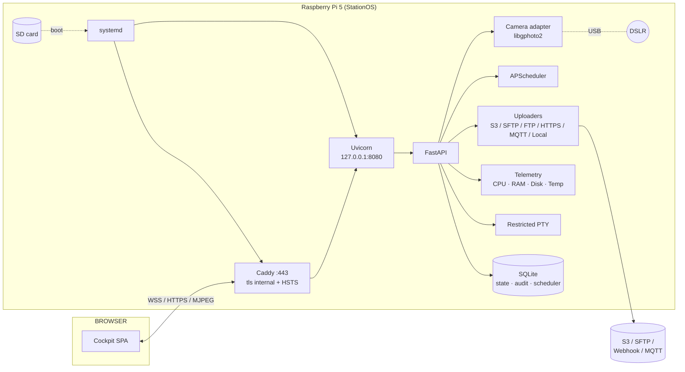

# Arclap Station

[](LICENSE)
[](https://github.com/arclap-af/arclap-station/actions/workflows/test.yml)
[](https://github.com/arclap-af/arclap-station/actions/workflows/release.yml)

Arclap Station is the on-device cockpit for a Raspberry Pi 5 tethered to a DSLR. Plug a Pi into a Canon, Nikon, Sony, Fuji (or any libgphoto2-supported body), flash an SD card, and open `https://arclap-st-<serial>.local/` from a laptop on the same LAN. The first-boot wizard walks you through Wi-Fi, time zone, login, camera, schedule, destinations and an acceptance test — then signs off with a tamper-evident report.

It's Python/FastAPI + Vite/React + TypeScript, designed to be flashed once and forgotten until the next firmware bump.

---

## 1. What it is

A self-contained device controller you flash onto an SD card and put on a shelf. It survives 2-year unattended construction-site deployments and is built to self-heal from any single fault without a human. Current release: **v0.9.2**.

**Capture + cockpit**
- A **10-step setup wizard** (Wi-Fi, time, login, camera, schedule, destinations, pairing, acceptance).
- A **still-image camera page**: a big Capture button plus a preview of the last shot with its EXIF — no live MJPEG (deliberately dropped; the station is a capture device, not a viewfinder).
- The camera page uses **real gphoto2 choices** for ISO / shutter / aperture chips — no hardcoded lists.
- **APScheduler** for time-lapse and interval captures (1 min – 24 h), with active-hours, day-of-week, per-schedule destination routing, and a "keep local copy" toggle — persisted across reboots.
- **EXIF auto-rotate + watermark on by default** on every capture (serial · site · UTC timestamp) for legal/insurance proof.
- **Perceptual-hash (dHash) deduplication** drops near-identical frames in a 10-min window — opt-in via `dedup_threshold`.
- **Daily pre-rendered timelapse MP4s** rendered by ffmpeg at 03:30 — the strategic retention asset.

**Camera reliability (A–K)**
- USB autosuspend off for 8 camera vendors (Canon / Nikon / Sony / Fuji / Olympus / Panasonic / Pentax / Leica) via udev.
- Auto-power-off disabled on the body via PTP after init; a **3-min keepalive poll** holds the PTP session awake between scheduled captures.
- `char-usb_device` cgroup grant (the fix for the silent `-7 I/O problem` under systemd hardening).
- An `RLock` serialises all libgphoto2 access so concurrent cockpit requests can't race `Camera().init()`.
- Init retry with 1s / 3s / 10s backoff; pre-capture wake probe; capture target = SDRAM (never CF/SD card).
- Recovery ladder for a wedged camera: reconnect → `/sys` re-authorize → **USB bus power-cycle** (`uhubctl`, if a switchable hub is fitted) → service self-restart after N consecutive init failures.
- Cross-process **camera health beacon**; 15s grace after USB reset; firmware-lockup + flap detection.
- 45s in-thread capture timeout via `threading.Timer` (respects libgphoto2 thread affinity).
- **Fail-fast adapter**: camera API endpoints return in ms (not 20s) when the camera is unplugged.

**Stability & self-recovery (v0.9)**
- **Software watchdog**: `WatchdogSec=60` + sd_notify pings from the asyncio loop — a *hang* (not just a crash) is killed + restarted within 60s.
- **Pi hardware watchdog** (`RuntimeWatchdogSec=15`): reboots the box if systemd/kernel itself hangs.
- **Corrupt-boot self-heal**: on boot, `state.db` integrity is checked and auto-restored from the newest nightly backup if corrupt (the corrupt file is preserved aside).
- **UPS HAT support** (graceful, auto-detected): clean shutdown below 12% on battery to prevent SD corruption.
- **SD-card longevity**: journald size-capped + root mounted `noatime` to cut write wear.

**Health & observability (v0.9)**
- **Self-test** (`/api/health/selftest`): 8 fail-soft probes (camera, storage, clock, destinations, queue, temp, memory, power) → overall ok/warn/bad + 0–100 score, each with a plain-English fix hint. Surfaced in **Settings → Health**.
- **Proactive alerting**: POSTs to a configurable webhook on health degrade/recover + a periodic **fleet heartbeat** (so a silent station is detectable by the absence of a beat).
- **Activity tab**: the audit-log timeline (every capture, upload, schedule, login, system event), filterable.
- **Fleet station-card** (`/api/system/info`) + read-only **GitHub update-check** (`/api/system/update/check`).
- **Resilience acceptance group**: verifies — non-destructively — that both watchdogs are armed, backups are restorable, DB integrity holds, indexes are present, and `noatime` is mounted.

**Storage + retention**
- **4-tier retention sweep** (HOT 7d / WARM 30d / COLD 90d / archive) with emergency mode at >95% disk.
- **Daily gzipped state.db backup** to `/var/lib/arclap/backups/` with 7-day rotation.
- **Weekly `PRAGMA integrity_check`** (Sunday 05:00) — catches SD-card wear before app errors.
- **Disk-full gate**: capture refused at < 2% free with audited `capture.refused_disk_full` event.
- SQLite tuned: WAL, busy_timeout=5s, synchronous=NORMAL, 32MB cache, 64MB mmap, 15-min periodic checkpoint.

**Uploaders**
- Multi-destination queue with retries: S3 · SFTP · FTP/FTPS · HTTPS webhook · local · MQTT (+ Arclap Cloud).
- **Fernet-AEAD encryption** of destination secrets at rest; edits never clobber a stored secret (redacted-sentinel guard).
- Probes are tuned for real intakes: FTP/S3/webhook test with a `.jpg` body, skip RETR, best-effort DELETE.
- **Orphan rescue**: photos captured before any destination existed are auto-queued the moment one is added.
- **Circuit breaker** pauses the queue for 5 min when every destination has failed 10× in the last hour.

**Networking**
- **NTP fallback ladder**: Cloudflare → Google → pool.ntp.org.
- **DNS fallback**: 1.1.1.1 / 9.9.9.9 / 8.8.8.8 with DNSOverTLS=opportunistic.
- **Multi-NIC route priority**: ethernet (50) < WiFi (300) < cellular (600).
- **WiFi credentials UI** via nmcli (scan + connect + forget; PSK never logged).
- **Captive portal detection** via Cloudflare `generate_204` sentinel.
- **WireGuard support tunnel** (outbound-only, cockpit toggle) for remote ops.
- **MQTT heartbeat** every 30s for fleet management (when paired to the Admin Cockpit).

**Security**
- PIN bcrypt (rounds=12), per-IP brute-force lockout (5 in 15 min), PIN rotation reminder at >90 days.
- **Audit log hash chain** with **signed export** (SHA-256 + optional Ed25519).
- All 4 WebSocket endpoints auth-gated.
- systemd hardening: ProtectSystem=strict, ProtectClock, ProtectHostname, RestrictAddressFamilies, KeyringMode=private, UMask=0027, NoNewPrivileges, RestrictNamespaces.
- Caddy `tls internal`, ufw + fail2ban, SSH hardening (PasswordAuthentication no, MaxAuthTries 3).
- **Danger Zone** endpoints (reboot, restart-service, factory-reset) gated by PIN re-entry.

**Observability**
- **Prometheus `/metrics`** endpoint (request counter + latency histogram + system gauges).
- **`/api/diag/*`**: services, SMART, boot-history, slow-log, percentiles (p50/p95), tunnel, support-bundle, sentry-status.
- **`arclap-station support-bundle`** writes a redacted `.tar.gz` (logs + gzipped DB dump + dmesg + audit tail) for support tickets.
- **Python faulthandler** → crash traceback to `/var/log/arclap/crash-<pid>.txt` on SIGSEGV / SIGFPE / SIGABRT.
- **Sentry crash reporting** (opt-in via `SENTRY_DSN`).
- **Camera flap detection** (≥3 recoveries/hour → `camera.flapping` audit).

**Cockpit UX**
- **xterm.js terminal** with full ANSI colour, scrollback, copy/paste, arrow-key history, plus a sidebar of categorised quick-commands.
- **Keyboard shortcuts**: `g h/c/g/s/d/t/n` page nav, `c` capture, `r` reconnect, `/` focus search, `?` shortcut help.
- **Toast queue** (5 stacked, click-dismiss).
- **Help tooltips** with doc deep-links.
- **Mobile-responsive CSS**: ≤900 px (tablet, 44 px tap targets) and ≤600 px (phone, full-screen modals, viewfinder vh cap). `prefers-reduced-motion` + `pointer:coarse` honored.

Everything is in one monorepo: backend (`backend/arclap_station` — 75 .py files) and frontend (`frontend/` — Vite + React 18 + TypeScript). The deployment layer turns those into a one-curl install on a fresh Pi.

---

## 2. Quick install

SSH into a freshly flashed Pi 5 running **Ubuntu 26.04 Server (arm64)** and run:

```bash
curl -fsSL https://raw.githubusercontent.com/arclap-af/arclap-station/main/install.sh | sudo bash
```

Pin a specific release:

```bash
curl -fsSL https://raw.githubusercontent.com/arclap-af/arclap-station/main/install.sh \
  | sudo ARCLAP_VERSION=v0.9.2 bash
```

Alternative (offline / from a cloned repo):

```bash
sudo apt update && sudo apt install -y git
git clone https://github.com/arclap-af/arclap-station.git
cd arclap-station
sudo bash install.sh
```

The 12-step installer runs:

1. apt deps (libgphoto2-dev, ffmpeg, caddy, nmcli, smartmontools, ufw, fail2ban).
2. Create `arclap` system user + dirs (`/etc/arclap`, `/var/lib/arclap`, `/var/log/arclap`).
3. Install Python wheel into `/opt/arclap-station/venv`.
4. Install frontend bundle into `/var/www/arclap`.
5. Install udev rules (camera USB autosuspend off for 8 vendors).
6. Install systemd units + drop-ins (timesyncd / resolved / NetworkManager / journald).
7. Install Caddy config (TLS internal, hostname `arclap-st-<last-8-of-cpu-serial>.local`).
8. Install Avahi/mDNS broadcast.
9. ufw + fail2ban + SSH hardening.
10. Reload systemd, enable + start `arclap-station` + `caddy` + 6 timers.
11. Wait for `/api/health` to return 200.
12. Print the cockpit URL.

After the install finishes (~3 minutes on first boot), the script prints:

```
┌────────────────────────────────────────────────────────────┐
│  Arclap Station is installed and running.                  │
└────────────────────────────────────────────────────────────┘

  Open on the same LAN:   https://arclap-st-1a2b3c4d.local/
  IPv4 fallback:          https://192.168.1.42/
```

Open the URL on a laptop on the same LAN. Trust the self-signed certificate. Walk the wizard. Done.

---

## 3. What you get

### Filesystem layout after install

```
/opt/arclap-station/
└── venv/                       Python 3.14 virtualenv with the installed package

/var/www/arclap/                Static frontend bundle (served by Caddy)
/etc/arclap/                    auth.json · station.json · destinations/* · dest.key
/var/lib/arclap/                state.db (incl. audit_log) · scheduler.db · backups/ ·
                                thumbnails/ · local-photos/ · *_health.json beacons
/media/sdcard/photos/           Captures (the only path Caddy never serves)
/var/log/arclap/                Diagnostics dumps (journald is canonical, size-capped)
```

### Architecture (Mermaid)



### ASCII overview

```
[ Laptop browser ] ──HTTPS──▶ [ Caddy :443 ] ──127.0.0.1:8080──▶ [ FastAPI ] ──libgphoto2──▶ [ DSLR ]
                                  │                                   │
                                  └── static (/var/www/arclap)
                                                                      │
                                                                      ├─▶ SQLite (/var/lib/arclap)
                                                                      ├─▶ Photos (/media/sdcard/photos)
                                                                      └─▶ Uploader worker ──▶ S3 / SFTP / …
```

---

## 4. Hardware checklist

| Item | Requirement | Notes |
|------|------|------|
| **SBC** | Raspberry Pi 5 (4 GB or 8 GB) | Pi 4 works in development with `ARCLAP_SKIP_HARDWARE_CHECK=1`, but production is Pi 5 only. |
| **Cooling** | Active fan (official Pi 5 fan or equivalent) | Long captures + USB camera + Wi-Fi = ~3.5 W continuous. |
| **SD card** | ≥ 32 GB Class A2, UHS-I U3 | We image the OS here; photos go to a USB-attached SSD if you mount one at `/media/sdcard`. |
| **Power** | Official 27 W USB-C PSU | Lower-amp PSUs throttle the USB bus and starve the camera. |
| **Camera** | Anything libgphoto2 supports tethered | Verify with `gphoto2 --auto-detect` on the Pi before shipping. |
| **USB cable** | High-quality data-rated cable, max 3 m | The cable is the #1 failure mode in the field. |
| **Network** | Wi-Fi 5 / Ethernet | Both work; the wizard configures Wi-Fi via NetworkManager. |

---

## 5. First boot walkthrough

The wizard is a 10-step linear flow. Each step is idempotent — you can back out and resume any time before "Finish".

1. **Welcome** — confirms hardware and firmware versions.
2. **Network** — Wi-Fi SSID + passphrase, or "use the Ethernet link I already have".
3. **Time zone & NTP** — IANA zone + optional custom NTP server.
4. **Identity** — operator account (bcrypt-hashed locally, never leaves the device).
5. **Camera** — auto-detected via libgphoto2; you select a model from the list.
6. **Exposure baseline** — sets shutter / aperture / ISO / white balance defaults.
7. **Schedule** — pick `single shot`, `interval` (e.g. every 5 min), or `cron`.
8. **Destinations** — add one or more uploaders (S3 / SFTP / FTP / HTTPS webhook / MQTT / local-only).
9. **Acceptance test** — captures a frame, runs an upload round-trip, signs a report with the device key.
10. **Finish** — locks the wizard, drops the operator into the live cockpit.

Re-running the wizard is possible from the Settings → Reset wizard menu, which requires the operator password.

---

## 6. Find your station on the LAN

```bash
# Linux / macOS — list every station on the link.
avahi-browse -prt _arclap._tcp

# macOS Finder shows it under "Network".
# Windows: Bonjour (installed by iTunes/iCloud) gives you arclap-st-<serial>.local.

# Forensic fallback when mDNS is filtered (some enterprise networks):
nslookup arclap-st-<serial>.local 224.0.0.251
ip neigh | grep -i b8:27:eb   # historical Pi MAC prefix
arp -a | grep -i raspberry    # likewise
```

The advertised TXT records include `role=station`, `api=/api`, `protocol=https`, and `path=/`, so a discovery client only needs an `_arclap._tcp` browse to populate the picker.

---

## 7. Troubleshooting

### Camera not detected

```bash
# Is the Pi seeing the USB device at all?
lsusb | grep -iE 'canon|nikon|sony|fuji|olympus|panasonic'

# Is gphoto2 seeing it?
sudo -u arclap gphoto2 --auto-detect

# Are the udev rules in place?
ls /etc/udev/rules.d/ | grep -E '40-libgphoto2|50-arclap'

# Is gvfs holding the device open?
ps aux | grep -E 'gvfs|gphoto2-volume-monitor'
sudo systemctl mask gvfs-gphoto2-volume-monitor.service
```

If the camera shows up with `lsusb` but not `gphoto2`, unplug, switch the body to PTP/MTP mode (Canon: Communication Settings → PC Connect; Sony: USB Connection → PC Remote), and replug.

### Capture fails with "Could not claim the USB device"

Another process owns the camera. Usually `gvfs-gphoto2-volume-monitor`. The installer masks it, but a system upgrade can re-enable it:

```bash
sudo systemctl mask gvfs-gphoto2-volume-monitor.service
sudo systemctl restart arclap-station.service
```

### USB device shows but is permission-denied

The `arclap` user must be in `plugdev`:

```bash
id arclap | tr ' ' '\n' | grep plugdev || sudo usermod -a -G plugdev arclap
sudo systemctl restart arclap-station.service
```

### No internet — installer fails at apt step

The installer needs `github.com` + the Raspberry Pi apt mirrors. Ethernet is the most reliable bring-up path; once running, the wizard configures Wi-Fi.

### Browser shows "Your connection is not private"

Expected. Caddy issues an `internal` self-signed certificate. Click through once; HSTS pins the hostname so the warning won't re-appear for a year.

### `https://arclap-st-<serial>.local/` resolves but times out

```bash
sudo systemctl status caddy
sudo systemctl status arclap-station
sudo journalctl -u arclap-station -n 50
```

Caddy listens on 443 and reverse-proxies to arclap-station on `127.0.0.1:8080`. If Caddy is up but the service is down, systemd (`Restart=always` + the software watchdog) should already be restarting it — check `systemctl status arclap-station` and `Settings → Health`.

### Captures succeed but uploads stall

The uploader runs **in-process** inside `arclap-station` (there is no separate
`arclap-uploader` service). Check the queue + destination state:

```bash
sudo journalctl -u arclap-station -n 80 | grep -iE 'upload|queue|dest'
ls -la /etc/arclap/destinations
```

Each destination has its own retry/backoff and is independently failable. The
cockpit's **Destinations** panel shows live queue depth + per-destination
errors, and **Settings → Health** flags a stalled queue with a fix hint.

---

## 8. Updating

The cockpit's **Settings → System → Software** card checks GitHub for a newer
release (read-only) and shows whether you're behind. To apply an update,
re-run the installer over SSH — it pulls the latest `main`, reinstalls the
package + frontend bundle, and restarts the service:

```bash
curl -fsSL https://raw.githubusercontent.com/arclap-af/arclap-station/main/install.sh | sudo bash
```

Captures pause for ~3 s during the service restart and resume on the next
scheduler tick. The boot-time integrity guard protects `state.db` if power is
lost mid-update.

> Note: there is intentionally no auto-apply / in-place self-update on the
> device yet — a hands-off A/B-rollback OTA is a StationOS-image phase that
> needs a test rig, not the live production Pi. The update-check above tells
> you *when* to run the installer; you stay in control of *when* it happens.

---

## 9. Uninstall

Stop + disable the units and remove the install tree (state, photos, and config
under `/var/lib/arclap`, `/media/sdcard/photos`, `/etc/arclap` are left in place
so you don't lose data by accident):

```bash
sudo systemctl disable --now arclap-station caddy \
  arclap-backup.timer arclap-retention.timer arclap-camera-watchdog.timer
sudo rm -rf /opt/arclap-station /var/www/arclap
sudo rm -f /etc/systemd/system/arclap-*.{service,timer} \
  /etc/systemd/system.conf.d/10-arclap-watchdog.conf \
  /etc/systemd/journald.conf.d/10-arclap.conf
sudo systemctl daemon-reload
```

To also wipe data: `sudo rm -rf /var/lib/arclap /etc/arclap /media/sdcard/photos`.
The cleanest reset for a field unit, though, is to re-flash the SD card.

---

## 10. Journalctl cheat sheet

```bash
# Live tail of everything Arclap.
sudo journalctl -fu 'arclap-*'

# Just the API service (camera, scheduler, uploader all run in-process here).
sudo journalctl -fu arclap-station

# Last boot's logs (after a crash).
sudo journalctl -u arclap-station -b -1 --no-pager

# Around a specific timestamp.
sudo journalctl -u arclap-station --since "2026-05-19 14:00:00" --until "2026-05-19 14:30:00"

# Errors only.
sudo journalctl -u arclap-station -p err

# JSON output (for piping to jq, telemetry).
sudo journalctl -u arclap-station -o json | jq 'select(.PRIORITY|tonumber < 4)'

# Watchdog probe trail.
sudo journalctl -u arclap-watchdog -n 20

# Caddy access + cert events.
sudo journalctl -fu caddy
```

See [`docs/journalctl-cheatsheet.md`](docs/journalctl-cheatsheet.md) for the full reference.

---

## 11. Building from source

```bash
git clone https://github.com/arclap-af/arclap-station
cd arclap-station

make setup           # creates backend/.venv + frontend/node_modules
make test            # runs both test suites
make dev             # backend on :8080 (mock camera), frontend on :5173
make wheel frontend  # produces dist/*.whl + dist/arclap-station-frontend.tar.gz
make deb             # Linux + fpm only; the .deb the installer consumes
```

To build the Pi OS image, push a tag — CI runs pi-gen and attaches `arclap-station-vX.Y.Z.img.xz` to the GitHub release. Building locally is unsupported; see [`docs/architecture.md#why-the-image-only-builds-in-ci`](docs/architecture.md).

---

## 12. Security model + threat model

In one paragraph: the Pi is treated as a hostile host on a hostile network. The cockpit binds **loopback TCP `127.0.0.1:8080`** — only reachable from the Pi itself — and Caddy reverse-proxies 443 to it with a self-signed certificate; HSTS is set to a year so a downgrade attack would have to break the user's prior trust on the first visit. The service runs under the `arclap` user with strict systemd hardening (`ProtectSystem=strict`, `ProtectHome=true`, `NoNewPrivileges=true`, an empty `CapabilityBoundingSet`, `RestrictNamespaces`, and a `@system-service @sandbox` syscall filter; `DeviceAllow=char-usb_device rw` is the only device grant). The PTY terminal is gated by login + a command allowlist. Captures live on `/media/sdcard/photos`; the API never serves the raw filesystem — only thumbnails through a path-validated handler. Destination secrets are encrypted at rest with **Fernet** (key from the kernel keyring, or a 0600 `/etc/arclap/dest.key` fallback on a headless Pi). All admin actions emit immutable, hash-chained rows into the `audit_log` table in `/var/lib/arclap/state.db` (signed export available).

See [`docs/threat-model.md`](docs/threat-model.md) for the long form.

---

## 13. License

Apache License 2.0 — see [LICENSE](LICENSE).

---

## 14. Screenshots gallery

> Placeholders until the CI pipeline lands screenshots from the Playwright happy-path.

| Screen | Image |
|--------|-------|
| Welcome | `docs/screenshots/01-welcome.png` |
| Network | `docs/screenshots/02-network.png` |
| Identity | `docs/screenshots/03-identity.png` |
| Camera | `docs/screenshots/04-camera.png` |
| Schedule | `docs/screenshots/05-schedule.png` |
| Destinations | `docs/screenshots/06-destinations.png` |
| Acceptance | `docs/screenshots/07-acceptance.png` |
| Cockpit | `docs/screenshots/08-cockpit.png` |

The annotated walkthrough lives in [`docs/wizard-walkthrough.md`](docs/wizard-walkthrough.md).
